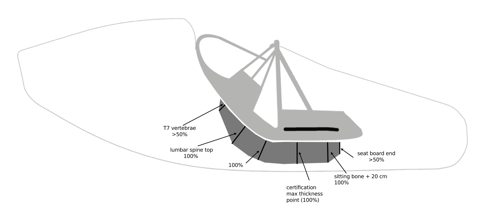

### CIVL Harness WG Timeline

#### 2021 Disentis Superfinals

- first Submarine prototypes
- Luc Armant wins on a Submarine

#### 2022 Nis European Championship

- Luc Armant wins the Championship on a Submarine
- Honorin 3rd place on Submarine + Zeno 2

#### 2023 CIVL Harness Working Group

- **June**
  - **Max Jeanpierre (Kortel):** Proposes limiting fairing length and defining a **minimum protector surface area.**
  - **Josh Cohn:** Supports Max Jeanpierre and is the first to propose a **minimum thickness** for back protectors in addition to a G-rating.
  - **Luc Armant (Ozone):** Argues against design-restrictive rules like fairing length, proposing to restrict packed volume and weight via a "box rule" instead.
- **July**
  - **Theunis de Bruin:** Introduces **Dr. Matt Wilkes' research** on harness safety and suggests a much tougher protector rating (<30G).
- **August**
  - **Tim Rochas (Niviuk):** Proposes making the EN test stricter (e.g., Max 40G)
  - **Simone Caldana (Woody Valley):** Agrees with improving EN test values but emphasizes the need to increase the protector's **minimum surface area**.
- **October**
  - **Zsolt Ero:** Proposes a detailed **minimum dimension** and thickness standard for protectors. [Spine anatomy illustration](assets/4spine.jpg)

  
  - **Josh Cohn:** Following Zsolt's post of impact graphs, Josh identifies the rapid rate of G-force change as **"jerk"** introducing this to the discussion.

- **November**
  
  - **Volodymyr Perevalov (Nearbirds):** Independently validates the importance of "jerk" (acceleration gradient) in his analysis of foam vs. honeycomb protectors.
  - **Dr. Matt Wilkes:** Joins the group as a **medical doctor**, **researcher**, and **paraglider pilot**. He published research on harness design and impact forces. He validates the focus on jerk ("low gradient decelerations"), calls Zsolt's dimensioning proposal "reasonable" and outlines his own recommendations.

#### 2024

- **January**
  - **Max Jeanpierre (Kortel):** Expresses concern that the group is focused "box dimensions" while ignoring protector performance and fairing behavior in stalls.
  - **Tim Rochas (Niviuk):** Reinforces the need to focus on protector safety by presenting NASA data to support his specific proposal for stricter EN test values (Max 40G, 7ms over 35G).
  - **Manufacturer Consensus:** A general consensus begins to form that updating complex protector standards is best handled by the official **EN working group (WG6)**.
- **October**
  - **Tim Rochas (Niviuk):** Confirms that WG6 has agreed to adopt stricter impact values (Max 42G).
  - **Zsolt Ero:** Publishes article:
    [The Future of Paragliding Harness Back Protectors](https://hyperpilot.substack.com/p/the-future-of-paragliding-harness)
    Proposes an interim **10 cm minimum thickness rule** to bridge the gap until a new jerk-based EN standard is released
- **November**
  - **8 Nov, Tim Rochas (Niviuk):**
    > We made some research about different types of harnesses and protections to have a look at the results between max G, max jerk, and protection thickness.
    >
    > ...
    >
    > What we can see is that the max 1300 g/s on jerk that Zsolt suggested is really, really low.
    >
    > This topic, including jerk values, will be discussed during the next WG6 meeting.
    >This is a really sensitive and technical topic, and I think we need to listen to the experts of this WG6 working group and not make a CCC harness standard too fast without thinking about all the effects (good and bad ones).
  - **22 Nov, Fred Pieri via Luc (Ozone):** Reply article:
    [Exploration of the Jerk Limit for Back Protectors](https://fredvol.bitbucket.io/Misc/jerk_analysis/p1/report_jerk.html)
    Points out Zsolt underestimated the min thickness, **correct is at least 12.2 cm+**. Also argues against a simple thickness rule.
  - **22 Nov, Luc Armant (Ozone):**
  - > I agree that jerk requirements should be dealt by WG6. And the same for other points of the back protection.
  - **26 Nov, Bill Hughes (CIVL):** Shares a final draft which officially **removes all specific protector requirements** from the CIVL standard, finalizing the decision to defer to WG6.

### Final Outcome

- "cardboard box" rule accepted
- all protector requirements dropped
- back fairing limit dropped
- open cockpit dropped

### **Effective date**

- Initially, dates like **2026** and **2027** were suggested (Fabio Loro, Brett Janaway).
- Dates like **2028** were discussed.
- Final consensus is **2030 Cat1**.
- New proposals can get in effect earliest **2031 Cat1**.

